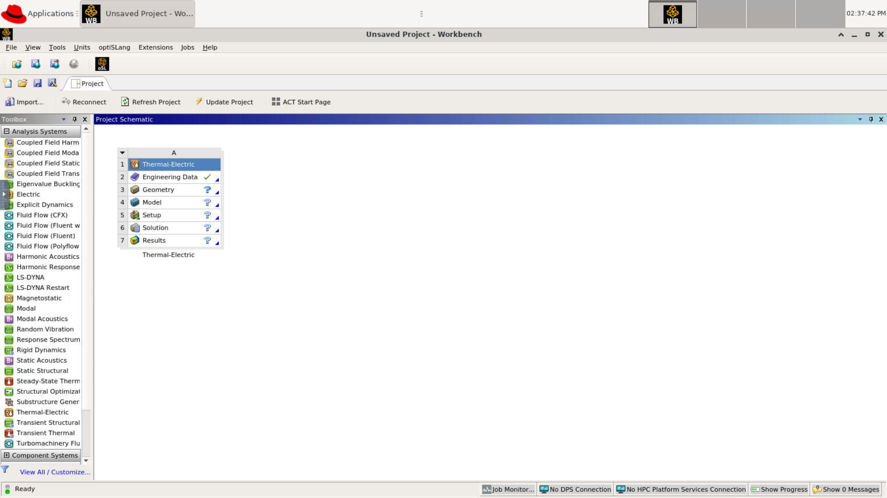

# Batch Connect - OSC Ansys Workbench


[](https://opensource.org/licenses/MIT)

## Overview

OSC Ansys Workbench is an Open OnDemand Batch Connect app designed for OSC that launches an Ansys Workbench as an interactive desktop. It runs in a heavily customized desktop/environment so that it works in OSC's supercomputer environment. Ansys is designed for students and researchers who need engineering simulation software.

- Upstream project: [Ansys](https://www.ansys.com/products/ansys-workbench)

## Screenshots



## Features

- Launches Ansys via VNC desktop on compute nodes
- Configurable cores, wall time, Ansys version and node type via the launch form

## Requirements

### Compute Node Software

This Batch Connect app requires the following software be installed on the
**compute nodes** that the batch job is intended to run on (**NOT** the OnDemand node):

- [Ansys Workbench] 15.0.7+
  - [CFX]
  - [Fluent]
- [Xfce Desktop] 4+

For VNC server support:

- [TurboVNC] 2.1+
- [websockify] 0.8.0+

For hardware rendering support:

- [X server]
- [VirtualGL] 2.3+

### Open OnDemand
- Open OnDemand 1.5+
- Scheduler: Slurm

### Optional

- [Lmod] 6.0.1+ or any other `module purge` and `module load <modules>` based
  CLI used to load appropriate environments within the batch job

[Ansys Workbench]: https://www.ansys.com/
[CFX]: https://www.ansys.com/Products/Fluids/Ansys-CFX
[Fluent]: https://www.ansys.com/Products/Fluids/Ansys-FLUENT
[Xfce Desktop]: https://xfce.org/
[TurboVNC]: http://www.turbovnc.org/
[websockify]: https://github.com/novnc/websockify
[X server]: https://www.x.org/
[VirtualGL]: http://www.virtualgl.org/
[Lmod]: https://www.tacc.utexas.edu/research-development/tacc-projects/lmod

## App Installation

### 1. Clone the repository

```sh
cd /var/www/ood/apps/sys
git clone https://github.com/OSC/bc_osc_ansys_workbench.git
cd bc_osc_ansys_workbench

# Pin to a release (recommended)
git checkout v0.24.1
```

You will not need to do anything beyond this as all necessary assets are
installed. You will also not need to restart this app as it isn't a Passenger
app.

To update the app you would:

```sh
cd bc_osc_ansys_workbench
git fetch
git checkout <tag/branch>
```

Again, you do not need to restart the app as it isn't a Passenger app.

## 2. Configure for your site

Edit `form.yml` and update these values for your cluster:

| Attribute | Default | Change to |
|-----------|---------|-----------|
| `cluster` | `"cardinal"` | Your cluster name |
| `version` | `"2024 R1"` | Version(s) of Ansys available on your system |
| `node_type` | OSC-specific node types | Node types available on your cluster |

### 3. Verify

No OOD restart is needed. Visit your OOD dashboard and look for **ANSYS Workbench** under **Interactive Apps > GUIs**.

## Configuration

### form.yml attributes

| Attribute | Description | Default |
|-----------|-------------|---------|
| `cluster` | Target cluster ID | `"cardinal"` |
| `version` | Version of Ansys to load on compute node | `"2024 R1"` |
| `bc_num_hours` | Maximum wall time (hours) | `4` |
| `bc_num_slots` | Number of nodes | `1` |
| `num_cores` | Number of cores on node type | No default |
| `reserve_parallel_licenses` | If selected, reserves Ansys parallel licenses for the duration of the job | False |
| `node_type` | Compute node type (any, vis, hugemem) | `any` |
| `bc_vnc_resolution` | Resolution of VNC desktop session | 1228 x 691 |
| `user_license_provider` | Whether to use an OSC or external Ansys license | `I can use the OSC license` |
| `extern_license_server` | (Optional) External license server | No default |
| `extern_license_file` | (Optional) External license file | No default |

## Environment variables

| Variable | Required | Description |
|----------|----------|-------------|
| `ANSYSLMD_LICENSE_FILE` | Yes | Path to Ansys license source |

## Troubleshooting

### Job starts but app doesn't appear (Batch Connect)

1. Check the job's `output.log` in `~/ondemand/data/sys/bc_osc_ansys_workbench/`
2. Verify the module loads correctly: `module load ansys/<version>`
3. For VNC apps, verify the window manager is installed: `which xfwm4`

### Connection timeout

The app may need more time to start. Increase the connection timeout or check that the compute node can open the required port.

## Testing

| Site | OOD Version | Scheduler | Status |
|------|-------------|-----------|--------|
| Ohio Supercomputer Center | 4.1.4 | Slurm     | Production |

To verify your installation:

1. Launch the app from the OOD dashboard with default settings
2. Confirm the application loads in the browser

## Known Limitations

- Parallel licenses are shared across users; if licenses are not requested with the job, they are checked out at runtime, which can cause requested cores to differ from actual usage and reduce availability for other jobs. 
 
## Contributing

Contributions are welcome. To contribute:

1. Fork this repository
2. Create a feature branch (`git checkout -b feature/my-improvement`)
3. Submit a pull request with a description of your changes

For bugs or feature requests, [open an issue](https://github.com/OSC/bc_osc_ansys_workbench/issues).

This app is part of the [OOD Appverse](https://ondemand.connectci.org/affinity-groups/ood-appverse). Join the [Appverse Affinity Group](https://ondemand.connectci.org/affinity-groups/ood-appverse) to connect with other contributors.

## References

- [Ansys Workbench](https://ansys.com/products/ansys-workbench)
- [Open OnDemand](https://openondemand.org/) — the HPC portal framework

## License

* Documentation, website content, and logo is licensed under
  [CC-BY-4.0](https://creativecommons.org/licenses/by/4.0/)
* Code is licensed under MIT (see LICENSE.txt)
* Ansys, Ansys Workbench, Ansoft, AUTODYN, CFX, FLUENT, HFSS and any and all Ansys, Inc. brand, product, service and feature names, logos and slogans are trademarks or registered trademarks of Ansys, Inc. or its subsidiaries located in the United States or other countries.

## Acknowledgments

This app is built on [Open OnDemand](https://openondemand.org/), developed and
maintained by the [Ohio Supercomputer Center (OSC)](https://www.osc.edu/).

Open OnDemand is supported by the National Science Foundation under awards
[NSF SI2-SSE-1534949](https://www.nsf.gov/awardsearch/showAward?AWD_ID=1534949)
and [NSF CSSI-Frameworks-1835725](https://www.nsf.gov/awardsearch/showAward?AWD_ID=1835725).
